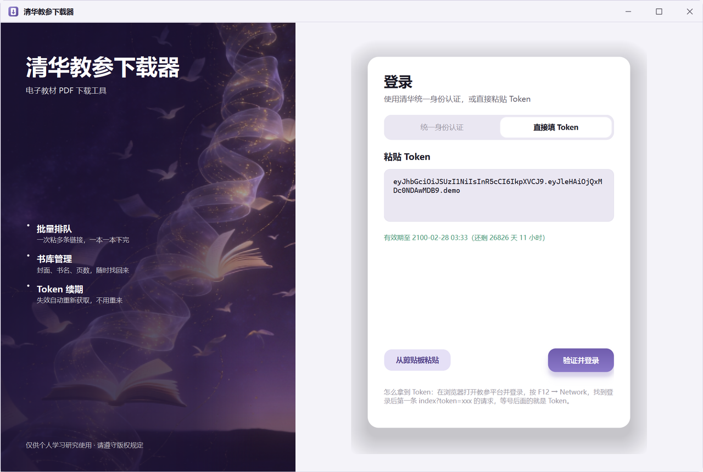
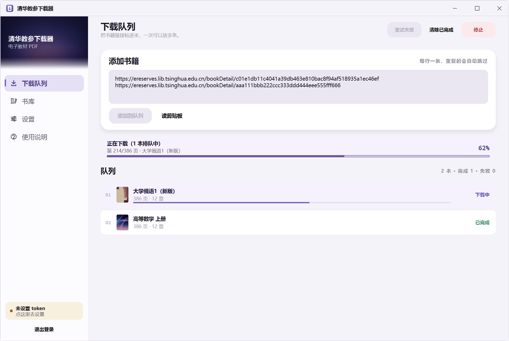
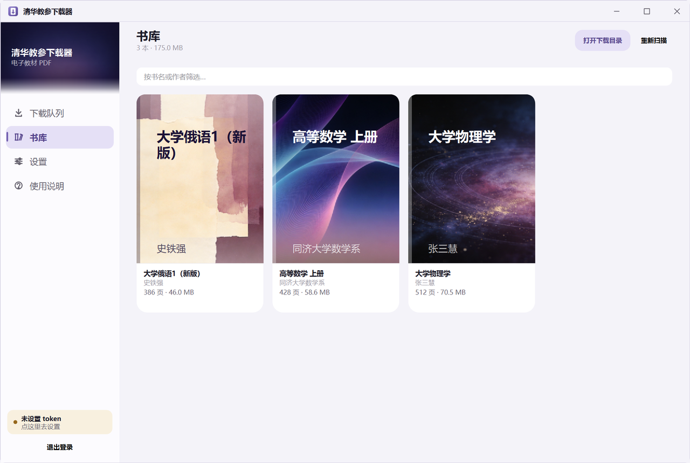

# 清华教参下载器

把清华教参平台（[ereserves.lib.tsinghua.edu.cn](https://ereserves.lib.tsinghua.edu.cn/)）上的电子教材，整本下载成清晰的 PDF。

装好即用，不需要 Python、不需要命令行。带图形界面、批量排队、书库管理和断点续传。

> **请先读这一条。** 下载得到的电子书版权归原作者与出版方所有，**仅供个人学习**。
> 请不要传播，尤其是不要传播给校外未授权的人；也请避免批量下载整库书籍。
> 程序不提供任何绕过认证或授权的能力——它只是把你**已经有权限看**的书，从"一页页截图"
> 变成"一个 PDF"。

---

## 目录

- [安装](#安装)
- [第一次使用](#第一次使用)
- [界面](#界面)
- [日常使用](#日常使用)
- [常见问题](#常见问题)
- [数据存在哪、怎么彻底删掉](#数据存在哪怎么彻底删掉)
- [卸载](#卸载)
- [命令行方式（可选）](#命令行方式可选)
- [系统要求](#系统要求)
- [版权与免责](#版权与免责)

---

## 安装

1. 到本仓库的 [Releases](../../releases) 页面下载最新安装包
   **`TsinghuaBookCrawler-2.0-Setup.exe`**（约 133 MB）。
2. 双击运行，一路"下一步"。
3. 装完从开始菜单或桌面快捷方式启动。

安装**不需要管理员权限**，默认装在当前用户目录：

```
%LOCALAPPDATA%\Programs\TsinghuaBookCrawler
```

### Windows 弹出"已保护你的电脑"怎么办

安装包没有购买代码签名证书，所以 SmartScreen 会拦一下。点
**"更多信息" → "仍要运行"** 即可。这不是程序有问题——是没交钱买证书。

---

## 第一次使用

启动后先到登录页。两种登录方式，任选一种：

| 方式 | 怎么做 | Token 过期后 |
| --- | --- | --- |
| **统一身份认证**（推荐） | 在应用内嵌的浏览器里输账号密码、完成双因子认证 | **自动重新获取**，你不用管 |
| **直接填 Token** | 从浏览器里抓一串 Token 粘进来 | 程序会提醒你换一个 |

### 方式一：统一身份认证（推荐）

点"统一身份认证"，应用内会打开清华的登录页面。正常输入账号密码、完成双因子认证即可。

登录成功后 Token 会被**自动截获**，你不需要手动复制任何东西。

内嵌浏览器用的是**持久化配置**，所以如果登录时勾了"信任此设备"，下次 Token 过期时
可以真的自动续期，而不是每次都重走一遍双因子。

### 方式二：直接填 Token

如果你不想在应用里输密码，可以手动抓一个 Token：

1. 用浏览器打开清华教参平台。
2. 按 **F12** 打开开发者工具，切到 **Network（网络）** 面板，**保持它开着**。
3. 现在再登录教参平台。
4. 在请求列表里找到一条 `index?token=eyJh...` 的请求，
   把等号后面**那一整串**复制下来。
5. 回到本程序，粘进"设置"页的 Token 框，点"校验 Token"。

> ⚠️ 一定要**先打开开发者工具，再登录**。顺序反了就抓不到这条请求——
> 这是最常见的失败原因。

Token 也可以直接粘整条 `...index?token=xxx` 的地址，程序会自己抠出来。

### Token 会过期，这是正常的

清华教参发的 Token 实测**寿命只有 63 分钟**。程序会：

- 在侧边栏底部显示**当前登录的账号**（姓名 + 学号）和**剩余时间**；
- 剩余时间不足时提示"建议尽快重新登录"；
- 下载中途 Token 失效时，统一身份认证模式会**自动回到登录页重新获取**，
  然后**自动接上刚才失败的那本书**，不用你手动点重试。

想换账号，点侧边栏的"退出登录"。

---

## 界面

左边是导航，右边是工作区，一共四个页面。

### 下载队列

把书籍链接粘进输入框，**一行一条**，可以一次粘很多本。然后点"添加到队列"、
再点"开始下载"，程序会一本一本地下载完。

- 中途可以随时点"停止"——**已经下好的部分会保留**，下次接着下；
- 失败的书会标明原因，点"重试失败"重来，已成功下载的页面不会重复下载。

书籍链接长这样（就是浏览器地址栏里那一整条）：

```
https://ereserves.lib.tsinghua.edu.cn/bookDetail/c01e1db1...
```

### 书库

下载完的书会自动入库，带封面、书名、作者、页数和文件体积。

- 点封面 → 打开 PDF
- 点文件夹图标 → 在资源管理器里定位到该文件

### 设置

| 项目 | 说明 |
| --- | --- |
| Token | 登录凭证，可校验是否有效 |
| 保存位置 | PDF 存到哪，默认在安装目录下的 `downloads` |
| 进程数 | 同时下载几个页面。默认 4；网络环境严格时可以调到 2 |
| PDF 质量 | 10 最高最清晰。调小可以明显减小体积 |
| 保留临时图片 | 取消勾选则在生成 PDF 后自动删掉图片，省磁盘 |

### 使用说明

上面这些步骤和常见问题，应用内也有一份，忘了可以直接看。

---

## 日常使用

标准流程就是三步：

1. **复制链接** —— 在浏览器里打开书，复制地址栏完整的链接。
2. **粘进队列** —— 可以一次粘很多本，然后开始下载。
3. **去书库拿 PDF** —— 下完自动入库。

程序支持**断点续传**：关掉再打开、或者中途停止，已经下好的页面都不会重复下载。

---

## 常见问题

**提示 Token 不正确 / 已过期**

Token 和登录会话绑定，会过期。用统一身份认证模式的话程序会自己续；手动填 Token
的话重新抓一个换上。

**下载到一半失败了**

在"下载队列"里点"重试失败"。已经成功下载的页面不会重复下载，所以重试很便宜。

**某本书一直失败**

先确认这本书在你的账号权限范围内，并且链接是 `bookDetail` 详情页链接。
也可以在"设置"里把**进程数调到 2** 再试——有些网络环境并发一高就会被拒。

**PDF 太大 / 太糊**

在"设置"里调"PDF 质量"。10 是最高最清晰，往小调会明显减小体积。

**想省磁盘**

在"设置"里取消勾选"保留临时图片"，生成 PDF 后会自动删掉图片。

**书库里的书显示"文件已丢失"**

PDF 被手动删掉或移动了。记录还在，点回收站图标可以清掉这一条。

**侧边栏那行倒计时会自己走字**

它对，你没错。程序静置时也会每 30 秒刷新一次剩余时间——不刷的话静置半小时后那行字就是错的。

**登录页的内嵌浏览器打不开**

少见，通常是系统缺运行库。程序会明确告诉你，并让你改用"直接填 Token"。

**窗口拖不动 / 缩放不了？**

标题栏按住就能拖，四边能缩放，和资源管理器一样，包括拖到屏幕边缘自动吸附。

---

## 数据存在哪、怎么彻底删掉

程序把设置、书库记录和登录会话存在这里：

```
%LOCALAPPDATA%\TsinghuaBookCrawler
```

| 里面是什么 | 说明 |
| --- | --- |
| `config.json` | 设置（保存位置、进程数、PDF 质量等） |
| `library.json` | 书库记录（书名、路径、页数等） |
| `webprofile\` | 内嵌浏览器的配置，**登录会话在这里** |
| `cache\` / `covers\` | 缓存与封面缩略图 |
| `config_archive\` | 配置占位 |

**卸载不会删这个目录**，你下载的 PDF 也不会被删。

想彻底清干净（包括登录状态），卸载后手动删掉上面这个目录即可。

---

## 卸载

开始菜单 →「清华教参下载器」→「卸载」，或在 Windows「设置 → 应用」里卸载。

卸载只会删掉程序自己的文件，**不会**删掉你下载的电子书，也**不会**删掉上面的配置目录。

---

## 命令行方式（可选）

不想用图形界面也可以走命令行。装好程序之后直接调 exe 即可：

```
TsinghuaBookCrawler.exe -h
```

也可以从源码跑（需要先装 Python 3.10+）：

```
pip install -r requirements.txt
python cli.py -h
```

基本用法：

```
python cli.py "https://ereserves.lib.tsinghua.edu.cn/bookDetail/c01e1db1..." --token eyJhb...
```

| 参数 | 说明 |
| --- | --- |
| `-t, --token` | **必需。** 从 `/index?token=xxx` 抓到的 Token |
| `-n N` | 进程数，`1~16`，默认 4 |
| `-q Q` | PDF 质量，`3~10`，默认 10（最高） |
| `-d, --del-img` | 生成 PDF 后删掉临时图片 |
| `-r, --auto-resize` | 自动统一页面尺寸 |

默认下载到当前目录下的 `download` 子目录。

---

## 系统要求

- **Windows 10 64 位**或更高（安装包按 x64 构建）
- 约 **500 MB** 磁盘空间（程序本体含内嵌浏览器）
- 能访问 `*.tsinghua.edu.cn` 和 `*.lib.tsinghua.edu.cn` 的网络

---

## 版权与免责

- 本程序**仅供清华师生方便个人学习之用**。
- 下载得到的电子书**版权归原作者与出版方所有**，请不要传播，尤其是不要传播给
  校外未授权者；也坚决反对任何批量下载整库书籍的违规行为。
- 本程序不提供任何绕过认证或授权的能力。
- 请自觉维护版权、合理使用资源。一切滥用本程序导致的不良后果，作者概不负责。

---

# 以下是开发者文档

面向想读源码、改界面或自己重新打包的人。只用软件的话，上面就够了。

## 项目沿革

这个仓库有两段历史，**两套版本号是分开的**，别弄混：

### 桌面版（本 README 上部讲的就是它）

| 版本 | 说明 |
| --- | --- |
| **桌面版 2.0** | 当前发布版。修复下载完成时崩溃、下载线程越界操作界面、文件夹改名后显示「文件已丢失」三个问题。 |
| 桌面版 1.0 | 全部推倒重写成 PyQt6 桌面应用：图形界面、内嵌浏览器登录、批量队列、书库、安装包。 |

### 上游脚本（原作者 [lflame](https://github.com/lflame) 的 `TsinghuaBookCrawler`）

本项目基于 lflame 的 `TsinghuaBookCrawler` 开发。脚本版历史如下（**版本号与桌面版无关**）：

<details>
<summary>展开脚本版版本历史（v1.0 – v3.0）</summary>

#### v3.0 —— 2024/11/7

教参平台再次更新（变为 `ereserves`，而不是原本的 `reserves`），所以更新了 v3.0 版本。由于联邦认证要求双因子认证（2FA），脚本取消了用户名和密码输入机制，改为手动获取 Token 作为参数传入。

随之更新的一些其他特性：

* 修复了下载图片时 Ctrl+C 异常的问题；
* 修正 requirements.txt 以及 multiprocessing 处理代码，兼容不同 python 版本；
* 目前默认保留下载图片，可以加上 `-d` 取消保留。

#### v2.1.3 —— 2023/11/17

* 增加了 `-r/--auto-resize` 参数，可以自动统一页面尺寸。

#### v2.1.2 —— 2023/9/18

修复了下载部分书籍时存在的 bug，包括：

* 部分书籍网页信息中不存在 `book_name`，导致无法下载；
* 部分书籍章节序号不连续。

#### v2.1.1 —— 2023/1/22

* 更新 PyMyPDF 版本。

#### v2.1 —— 2021/3/4

* 大幅优化了几乎同等质量下生成的 PDF 文件大小；
* 支持质量选项 `-q [3~10]`，默认为 10（最高质量），调小该值可以在降低清晰度的前提下降低 PDF 文件大小。

#### v2.0 —— 2021/2/21

由于教参平台接口更新，脚本迎来 v2.0：

* 书名提取可能失效，此时按照旧版本习惯会使用数字串代替；
* 新接口似乎只提供了唯一清晰度，于是清晰度选择被取消。

#### v1.2.2

* 对于多章节最高清晰度不同的少数情况进行了处理，将对每个章节链接都进行一遍最高清晰度和图片格式的确定；
* 改进异常处理，修复网络状况不稳定时进程阻塞的 bug。

#### v1.2.1

* 修复 v1.2 中默认清晰度的设置，当不显式使用 `-s {1, 2, 3}` 指定清晰度时，将自动地对三种清晰度进行确认，选择最高清晰度。

#### v1.2

* 加入多章节书籍的一键下载和自动合并；
* 加入 `-s {1, 2, 3}` 清晰度选择，且提高默认清晰度；
* 加入链接正则化统一处理。

#### v1.1

* 更改参数输入方式，提高安全性；
* 教参平台 URL 支持 https。

#### v1.0

* 支持自动认证清华身份；
* 支持多进程快速下载；
* 支持"断点续传"；
* 支持自动识别书名和页数。

</details>

**上游背景**（原作者原话）：疫情期间购买教材较为困难，为了方便大家在线学习写了这个爬取清华教参的脚本。

## 源码结构

仓库根只放入口和构建配置，代码全在 `crawler/` 包内：

```
gui.py                      开发态：启动图形界面
cli.py                      开发态：走命令行
launcher.py                 打包入口（exe 的四种用法都由它分发）
TsinghuaBookCrawler.spec    PyInstaller onedir 打包配置
installer.iss               Inno Setup 安装包脚本

crawler/
  entry.py                  模式分发：图形界面 / 命令行 / 自检 / 截图
  selftest.py               打包产物自检（66 项）
  screenshot.py             把六个界面渲染成 PNG（验收用）
  core/                     与界面无关的核心逻辑
    engine.py               教参平台 API：解析书籍 / 章节 / 页图
    queue.py                下载队列：编排、断点、重试、Token 续期
    store.py                设置与书库的持久化
    worker.py               后台线程
    tokeninfo.py            解析 Token，算剩余寿命
    cli.py                  命令行参数
  gui/
    theme.py                设计令牌（颜色/字号/间距/动效）唯一来源
    shell.py                主窗口：页面切换、nativeEvent、退出流程
    titlebar.py             自绘标题栏 + 命中测试
    sidebar.py              左侧导航
    login.py                登录页（内嵌浏览器 / Token 两种模式）
    backdrop.py             天幕与化开区（自绘，无图片依赖）
    widgets.py              通用控件
    covers.py               书库封面生成
    views/                  四个页面
  legacy/                   上游脚本版的原始实现，仅命令行模式仍在用
  assets/                   图标与底图

tests/                      测试与界面冒烟
tools/                      守卫脚本（边缘、对比度、设计语言…）与出图工具
example/                    README 里用到的界面截图
```

### 三个入口的关系

`gui.py` / `cli.py` / `launcher.py` 都是薄壳，真正的分发在 `crawler/entry.py`，
保证「源码直接跑」和「打包后跑」走的是同一条路。

`launcher.py` 必须留在包外面：PyInstaller 会把入口脚本当作顶层 `__main__` 执行，
脚本里的相对导入会报 `attempted relative import with no known parent package`。

### `crawler/legacy/` 是什么

原作者 lflame 脚本版里的 `auth_get` / `download_imgs` / `hhhimg2pdf` / `utils`，
是 ereserves 新接口那一版的实现。图形界面走的是 `crawler/core` 里的重写版，
**不依赖它们**；但命令行模式（`cli.py <url> --token xxx`）至今仍调用它们，
所以收进包里保留，而不是删掉。要彻底去掉，需要把 `core/cli.py` 移植到
`core` 的实现上。

收进包之前它们在仓库根，靠「仓库根刚好在 sys.path 上」才 import 得到，
冻结后还得靠一段兜底代码再挂一次 `sys.path`；现在是普通相对导入。

## 从源码构建

需要 Python 3.10+（开发用 3.12）。在仓库根目录：

```
python -m venv venv
venv\Scripts\pip install -r requirements.txt PyQt6 PyQt6-WebEngine pyinstaller

:: 1) 打包成 onedir 目录  -> dist\TsinghuaBookCrawler\
venv\Scripts\pyinstaller --noconfirm --clean TsinghuaBookCrawler.spec

:: 2) 打包成安装包        -> dist\TsinghuaBookCrawler-2.0-Setup.exe
::    ISCC 的位置看装在哪（非管理员安装会落在 localappdata）：
::      C:\Program Files (x86)\Inno Setup 6\ISCC.exe
::      %LOCALAPPDATA%\Programs\Inno Setup 6\ISCC.exe
"%LOCALAPPDATA%\Programs\Inno Setup 6\ISCC.exe" installer.iss
```

打包后可以自检（会在 `%TEMP%\tsinghua_selftest.txt` 写一份报告）：

```
dist\TsinghuaBookCrawler\TsinghuaBookCrawler.exe --selftest
```

还可以把六个界面渲染成 PNG，用来肉眼验收：

```
dist\TsinghuaBookCrawler\TsinghuaBookCrawler.exe --screenshot _smoke\out
```

### 为什么是 onedir 而不是单文件

加了 QtWebEngine 之后依赖有好几百 MB。单文件每次启动都要解压一遍，登录页得等好几秒；
onedir 只是文件多，启动是即时的。

## 界面设计要点

界面全部自绘：无图片资源、无图标字体、无 emoji，动效可完全关闭。
设计令牌集中在 `theme.py`，改设计只改那一处。

### 窗口为什么是自己画的

系统那套白底灰字的标题栏和这个应用的配色不是一个体系。所以窗口是**无边框 + 自绘标题栏**。

重点不在于"自己画"，而在于**拖动和缩放没有被自己接管**：

- 左键按住标题栏 → 返回 `HTCAPTION`，拖动、双击最大化、拖到屏幕边缘吸附（Aero Snap）全部是系统原生行为；
- 窗口四边 → 返回 `HTLEFT`/`HTBOTTOM`/`HTBOTTOMRIGHT` 等，缩放也是原生的。

如果改成在 `mouseMove` 里自己 `move()` 窗口，会丢贴边吸附、拖动掉帧、
最大化状态下拖动的手感也不对——这是自绘标题栏最常见的做砸方式。

实现集中在 `shell.py` 的 `nativeEvent` 和 `titlebar.hit_test()`。**这里有两个坑，都踩过：**

1. `nativeEvent` 是从 Windows 消息循环回调进来的，PyQt 对虚函数里逃出去的异常的处理是
   **直接 abort**。表现是进程静默消失、退出码 `0xC000041D`，没有栈也没有日志。
   所以异常必须自己兜住，并且记进 `shell._NATIVE_ERRORS` 让自检能报出来。
2. **绝对不能调 `super().nativeEvent(...)`。** 实测在当前 PyQt6 + Qt6 上，那个基类实现
   本身就会让进程 abort，而且 `try/except BaseException` 也拦不住（它根本不是 Python 异常）。
   不处理的消息直接 `return (False, 0)`。

`hit_test` 里的坐标统一用 `QCursor.pos()` 而不是 `WM_NCHITTEST` 的 `lParam`：
后者是物理像素，在 150% 缩放下和 Qt 的逻辑坐标对不上。

窗口最外圈那条 1px 描边（`WINDOW_BORDER`）是自绘的。没有它，浅色窗口贴在浅色桌面上
没有边界。失焦时描边会变淡，和系统窗口行为一致。

Win11 上还会调 `DwmSetWindowAttribute(DWMWA_WINDOW_CORNER_PREFERENCE)` 让系统把四角剪圆。
这里刻意**不用** `WA_TranslucentBackground` 自己画圆角：半透明顶层窗口叠 QtWebEngine
会拖慢合成，而 DWM 这条是免费的。描边画圆角还是直角，取决于 DWM 调用是否真的成功。

### 内嵌浏览器为什么曾经"点一下要等 3 秒"

登录页左侧那块天幕是会呼吸的动画。它在**内嵌浏览器出现的时候必须停掉**，原因是实测出来的：

| 场景 | 主线程 CPU |
|---|---|
| 登录页 + 内嵌浏览器，天幕在动（66fps） | **62% ~ 74%** |
| 同上，天幕停掉 | 2% ~ 4% |

主线程被动画吃满，鼠标事件排在后面，于是"点一下要等 3 秒"。

### 为什么"退出登录"要换一代浏览器目录

退出登录时不是清空 profile，而是**换到下一代目录**（`webprofile/g0` → `g1`）。
清空目录会和正在运行的 Chromium 抢文件、留下半清状态的缓存；换目录是原子的。
旧的代会被清理掉。

### 天幕底图与化开区

天幕（侧边栏顶部那块深色区）在 `SKY_PANEL_H = 104` 之后接一条 `SKY_PANEL_FADE = 30`
的化开区，整块渐隐进侧边栏底色。天幕和下面的导航之间**不描边**——靠化开区接出去。

化开区有**四条**硬性要求，每一条都是踩过坑才写下的：

1. **必须不透明。** 曾经渐隐到全透明，靠"反正下面就是侧边栏底色"蒙混过关；
   但半透明意味着身后的东西会透出来——侧边栏下面正好压着已隐藏的登录页品牌区，
   于是侧边栏上浮出一行读不清的白字。
2. **起点必须逐列接住天幕最后一行。** 用整行平均色铺底试过：照片底部左右亮度本就不一样，
   一个平均值必然和某一列对不上，接缝处亮度跳变 142，是一道肉眼可见的横线。
3. **接缝那一行不能比它上面更暗。** 只取最后一行会出事：天幕收尾如果正在压暗，
   那一行就比倒数第二行暗一档；把它按比例拉伸铺满整条化开区，那点暗被原样放大，
   接缝处就出现一道**很细的黑边**。所以取**最后 3 行的列均值**（`_FADE_ROW_BAND`）。
4. **控件边界上不许留缝。** 这是最难缠的一条，因为它**不在绘制里**：化开区底边正好压在
   `SkyPanel` 的下边界、右边正好压在侧边栏右边界，而合成器会把控件最外那一行/列当成
   边缘**重新采样一次**，和控件外面的东西混一混，于是那一行/列变成紫灰色。
   决定性证据：把整条化开区填成一个纯底色、完全没有渐变，那一行**依然是暗的**
   （平铺 `(252,251,254)` → 实测 `(156,147,167)`；带渐变 → `(204,199,211)`）。
   所以问题不在渐变，在边界。修法是让 `SkyBackdrop` **比视觉上的化开区多出
   `_FADE_TAIL` 行、多出 `_FADE_TAIL` 列**（`SkyPanel.resizeEvent` 撑大它），
   多出来的部分全是纯底色，于是被污染的边缘被推到视觉接缝下面和侧边栏外面。
   注意**不能**在边界外面补一条盖片——那一行会被 Qt 裁掉（`visibleRegion()` 是空矩形）。

`tools/check_fade_opaque.py` 逐列量前三条。第四条**必须用** `tools/check_sky_edges.py`：
它开真实窗口抓位图。为什么不能靠前者——前者读的是 `grab()`，而 `grab()` 是**离屏渲染**，
压根不经过合成器那一次边缘重采样，所以这个缺陷连续躲过了所有基于 `grab()` 的守卫。

### 应用图标

`tools/make_icon.py` 用 PIL 现画，输出 `crawler/assets/app.ico`（10 档尺寸）和界面内用的
`logo*.png`。造型是一本白色的书加一个向下的箭头。

关键在**每个尺寸单独画**，分三档：`>=64` 完整（书脊 + 两条正文线 + 箭头）、
`32~48` 中等（去掉正文线、箭头加粗）、`<32` 只留纸面和箭头。

## 核心逻辑要点

### `resolve_book` 为什么返回 namedtuple

它返回 `BookRef(kernel, book_real_id, scan_id, meta)`。以前给它加 `meta` 的时候，
调用方分两批改的，漏掉了一处仍然按三个值解包——那是一颗一旦被调用就立刻 `ValueError`
的哑弹，而且没有任何测试覆盖得到。具名字段之后，取用一律走 `.kernel` / `.meta`，
再也不会因为"谁记得是几个值"而错位。

`tests/test_engine.py` 里为此留了一条"代码长相"的守卫测试。

### 认证失败不能靠状态码判断

服务器对失效 Token 返回的是 **HTTP 200** + `{"code":-21,"data":null,"info":"认证过期"}`，
**不是 401**——想靠状态码判断认证失败会静默漏掉。程序认的是 `data` 为 `null`。

清华教参发的 Token 是带 `exp` 的 JWT，**实测寿命只有 63 分钟**
（`iat` 到 `exp` 相差 3780 秒，这是拿真 Token 跑出来的）。所以"快过期"的阈值
跟着寿命走而不是写死，否则刚签发的全新 Token 也会一直显示"快过期"。

## 跑测试

```
venv\Scripts\python tests\test_engine.py          # 核心 E2E
venv\Scripts\python tests\test_store_queue.py     # 设置/书库/队列 45 项
venv\Scripts\python tests\test_worker.py          # 后台线程
venv\Scripts\python tests\test_gui_integration.py # 界面集成全链路
venv\Scripts\python tests\test_queue_threading.py # 下载线程不碰控件 + 状态字类型
venv\Scripts\python tests\test_relocate.py        # 文件夹改名后重新定位
venv\Scripts\python tests\smoke_window.py         # 四视图渲染与几何断言
venv\Scripts\python tests\smoke_login.py          # 登录页与 profile 轮换
venv\Scripts\python tests\test_tokeninfo.py       # Token 解析
venv\Scripts\python tools\measure_pages.py        # 各页内容高度
venv\Scripts\python tools\check_fade_opaque.py    # 化开区不透明与接缝
venv\Scripts\python tools\check_sky_edges.py      # 四条边（需桌面会话）
```

> `tests/smoke_weblogin.py` 会真的起一个 `QWebEngineView`。它在部分机器上
> 偶发以 `0xC0000374`（堆损坏）退出，与程序逻辑无关 —— 原始版本同样如此，
> 重跑即可。

每个脚本开头都会调 `tests/_isolate.py` 的 `isolate()`，把配置目录顶到临时目录——
设置和书库是真的写盘的，不隔离就会往你本机的 `%LOCALAPPDATA%\TsinghuaBookCrawler`
里塞测试数据。想手动指定位置，可以设环境变量 `TSINGHUA_CRAWLER_DATA_DIR`。

### 出图工具

`tools/gen_image.py` 是出图用的（走 Paratera 的 `/v1/images/generations`），
密钥从环境变量 `PARATERA_API_KEY` 读，**仓库里没有任何密钥**。
`tools/make_backdrop.py` 把原图处理成能发布的 `backdrop.jpg`，
`tools/sim_backdrop.py` 会按真实裁剪规则把候选图摆出来、压上真实位置的文字。
`tools/make_hero.py --cand` 出 3 张候选供挑，`--pick N` 把选中的裁成成品。
`tools/make_covers.py` 负责生成与裁切书库封面（源图在 `tools/art/`，不进包）。

## 界面截图

登录页（统一身份认证 / 直接填 Token 两种模式）：



下载队列：粘链接、批量排队、逐本下载，进度和失败原因都在列表里。



书库：下好的书自动入库，带封面、页数与体积。



> 以上截图由 `TsinghuaBookCrawler.exe --screenshot <目录>` 生成，界面里的书名、
> Token 等均为示意数据。

## 鸣谢

本项目基于 [lflame](https://github.com/lflame) 的
[TsinghuaBookCrawler](https://github.com/lflame/TsinghuaBookCrawler) 开发，
桌面版是在其脚本版基础上重写的。感谢原作者与所有贡献者：

* 感谢 awx 同学对清晰度选择的建议，由此新增了 v1.2 中清晰度选择的功能；
* 感谢 cyz 同学对默认清晰度问题的反馈，由此新增了 v1.2.1 中自动选择清晰度的功能；
* 感谢 sck 同学对不同章节最高清晰度设定可能不同这一问题的反馈，由此在 v1.2.2 中改进了自动选择清晰度的功能；
* 感谢 Thinzhang 同学反馈教参平台采用的新接口相关问题，由此更新了 v2.0 版本；
* 感谢 zhaofeng-shu33 和 HongYurui 同学反馈 PyMyPDF 版本问题，由此更新了 v2.1.1 版本；
* 感谢 Tsingshanyuan 同学反馈部分书籍网页信息中不存在 `book_name` 的问题，
  感谢 Long-Miao 同学反馈部分书籍存在章节序号不连续的问题，由此更新了 v2.1.2 版本；
* 感谢 Long-Miao 同学反馈页面尺寸统一性问题，并提交初步 PR，由此更新了 v2.1.3 版本；
* 感谢 baron0426 同学对 ereserves 新版教参平台 API 的分析，并完成了对应的核心代码编写，
  以此为基础更新了 v3.0 版本，桌面版的核心逻辑也基于它。

## 联系

* 原作者邮箱：315629555@qq.com, yyr22@mails.tsinghua.edu.cn
* 本仓库问题反馈：请提 [Issue](../../issues)

能力和时间均有限，若有写得不好的地方，还望指正。
